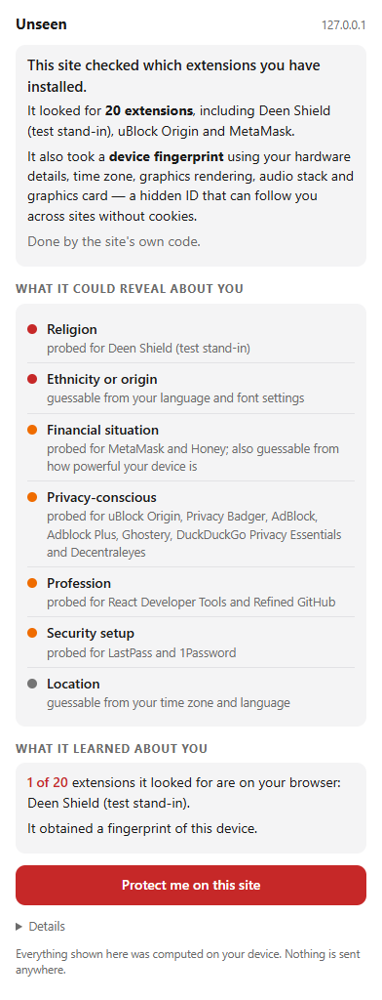
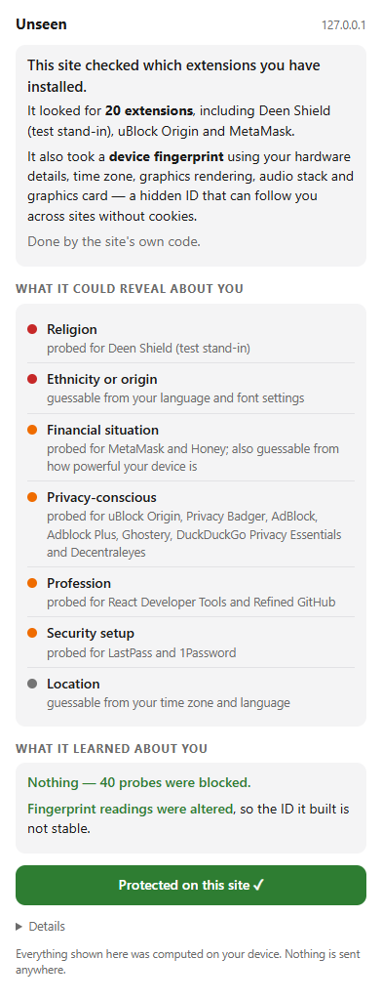

# Unseen — see what websites try to learn about you

**MuslimHacks 2026 · Challenge 03 (Online Privacy)**

A Manifest V3 Chrome extension that detects when a website **probes your installed
extensions** (the LinkedIn "BrowserGate" technique) or **fingerprints your browser**,
explains in plain language what that could reveal about you — religion, health, politics,
finances — and lets you stop it on that site with one click.

Everything runs on your device. Nothing is sent anywhere.

| Unprotected | Protected |
|---|---|
|  |  |

## Why this exists

Blockers like uBlock Origin and Privacy Badger work on *domains*. Extension probing and
fingerprinting are done by a site's **own** JavaScript calling browser APIs — there is no
domain to block, and Privacy Badger only watches third parties. Unseen watches the API
calls themselves, so it sees first-party scans, tells you *what the site tried to learn*,
and neutralises the probes without touching the network or breaking the page.

Plan, architecture and prior-art comparison: [`documents/PLAN.md`](documents/PLAN.md).

## Run it in your Chrome

1. Open `chrome://extensions` and switch on **Developer mode** (top right).
2. **Load unpacked** → choose the `extension/` folder.
3. (For the demo) **Load unpacked** again → choose `test-extension/`. This is a harmless
   stand-in for *Deen Shield*, so the demo probe has a real extension to find.
4. Browse. The toolbar badge lights up when a site probes your extensions or fingerprints
   you. Click it for the card. **Protect me on this site** turns on protection for that
   site and reloads it.

After editing extension files, click ↻ on the extension's card in `chrome://extensions`.

### The demo page

```sh
npm install        # once
npm run demo       # serves demo/ at http://127.0.0.1:8787/
```

The demo page does what LinkedIn's bundle was found doing: probes 20 extension IDs and
takes a canvas/audio/WebGL/hardware fingerprint, then prints what it learned.

- Unprotected: `extensions probed: 20  found: 1 (Deen Shield)` — badge red, card lists
  *Religion* first.
- Click **Protect me on this site** → `found: 0`, fingerprint hashes change, card says
  *"Nothing — 40 probes were blocked."*

## What it sees on real sites

Measured with the extension loaded in headless Chromium (`node tools/real-web.mjs`):

| Site | Extension probing | Fingerprinting |
|---|---|---|
| browserleaks.com/chrome | **5,000 IDs probed**, all observed; 0 found | no |
| browserleaks.com/chrome, *protected* | 5,000 probed, **5,000 blocked**; page still completes its test | no |
| amiunique.org/fingerprint | none | **yes** — 1st-party, 7 APIs |
| fingerprint.com/demo | none | **yes** — FingerprintJS v4, 11 APIs incl. audio |
| linkedin.com (logged out) | none on the landing page | **yes** — two `static.licdn.com` bundles, 10 APIs each |

Full notes: [`documents/real-web-results.md`](documents/real-web-results.md).
LinkedIn's extension scan was reported on logged-in pages; test logged in, in real Chrome.

```sh
node tools/real-web.mjs --headed https://example.com     # watch a site + print the inference
node tools/real-web.mjs --protect https://example.com    # same, with protection on
```

## How it works

```
extension/
  main/detector.js        MAIN world, document_start. Wraps fetch/XHR/src/href setters,
                          setAttribute, DOM mutations and 15 fingerprint APIs. Observes,
                          attributes each call to its script, reports. No chrome.* access.
  main/protect-flag.js    Registered per protected site; sets window.__unseenProtect.
  isolated/bridge.js      Relays detector batches to the service worker.
  background/sw.js        Aggregates per tab, badge, chrome.storage.local, protect toggle.
  background/inference.js PURE: events → probes, fingerprint verdict, traits, actors.
  data/extensions.json    extension id → name, trait (religion / health / finance / …).
  popup/                  The card.
demo/                     Demo page (probe + fingerprint + readout).
test-extension/           Fake "Deen Shield" target with one web-accessible resource.
tests/                    node --test unit tests; Playwright end-to-end; manual checklist.
tools/                    demo server, real-web runner, popup screenshotter.
```

**Detection.** A probe is any attempt to load a `chrome-extension://<id>/…` URL. A
fingerprint is one script touching ≥ 3 distinct API families (canvas, WebGL, audio,
navigator, Intl, fonts) within 5 s. `new Error().stack` names the calling script, so the
card can say who did it. The detector also watches whether each probe *succeeded* — that is
what the site actually learned about you.

**Explanation.** Probed IDs are mapped to traits (anchored on GDPR Article 9 special
categories). Copy always says *probed for* and *could infer*, never *knows*.

**Prevention (per site, opt-in).** Probe URLs are rewritten to a non-existent extension, so
the browser itself produces the genuine "not installed" failure with genuine timing.
Canvas/audio outputs get an imperceptible low-bit perturbation; hardware counts and GPU
strings become generic. Time zone and language are left alone — faking them breaks sites.
Nothing network-level is blocked.

## Develop and test

```sh
npm install && npx playwright install chromium
npm test            # 14 unit tests — pure inference logic, milliseconds
npm run e2e         # 15 end-to-end tests in real Chromium with both extensions loaded,
                    # including the before/after prevention proof (found: 1 → 0)
```

`tests/manual-checklist.md` is the real-Chrome checklist to run before a demo: positive
checks on tracking sites, and "does Gmail / YouTube / checkout still work with protection on".

## Gotchas

- **Branded Google Chrome (137+) silently ignores `--load-extension`.** Loading unpacked
  through the `chrome://extensions` UI works; only the command-line flag is dead. The test
  harness therefore uses Playwright's bundled Chromium.
- `test-extension/manifest.json` pins its ID with a `key` so it is
  `clogkfmebiojffofnmadeeekpjpppeop` on every machine. Don't remove it.
- The demo must be served over `http://` — content scripts don't run on `file://` by default.
- `static.licdn.com` shows as third-party on LinkedIn: it is LinkedIn's CDN but a different
  registrable domain. Detection is right; the label could use a same-company heuristic.

## Status

Steps 0–9 of the plan are done and green. Remaining: the manual real-Chrome checklist
(Step 10), extending `data/extensions.json` from the public BrowserGate ID list, and the pitch.
